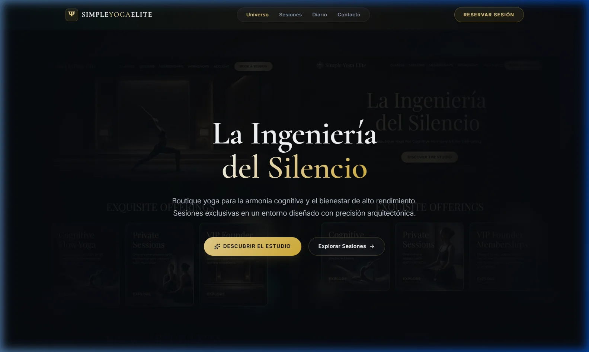

<div align="center">

<br/>

# Ψ &nbsp; S I M P L E &nbsp; Y O G A &nbsp; E L I T E

**Santuario Boutique · La Ingeniería del Silencio**

<br/>



<br/><br/>

[](https://react.dev/)
[](https://vitejs.dev/)
[](https://supabase.com/)
[](https://stripe.com/)
[](https://netlify.com/)

</div>

<br/>

---

## Acerca del Proyecto

Simple Yoga Elite es una aplicación web boutique para un estudio de yoga de alto rendimiento. Construida con una estética **Obsidian Zen Luxury** — tonos obsidiana oscuros (`#070a0f`), acentos en oro champagne (`#d4af37`), tipografía serif clásica (*Cormorant Garamond*) y tarjetas con efecto glassmorphism.

<br/>

## Características

| Módulo | Descripción |
|---|---|
| **Universo** | Página principal con hero cinematográfico, 3 disciplinas de élite y sección de precios |
| **Sesiones** | Catálogo de clases con calendario interactivo de reservas y modal de confirmación |
| **Diario** | Blog de bienestar con artículos de alto rendimiento |
| **Contacto** | Formulario de concierge privado con mapa integrado |
| **Pagos** | Integración con Stripe para procesamiento seguro de membresías |
| **Admin** | Panel de administración protegido con gestión de clases, blog y reservaciones |

<br/>

## Stack Tecnológico

```
Frontend     →  React 19 · React Router 7 · Lucide Icons
Build        →  Vite 7 · ESLint 9
Backend      →  Supabase (Auth + Database) · Stripe (Pagos)
Estilos      →  CSS3 Vanilla (Design Tokens + Glassmorphism)
Deploy       →  Netlify (SPA + Redirects)
```

<br/>

## Inicio Rápido

```bash
# Clonar
git clone https://github.com/FrankUsqAbant/simple-yoga-elite.git
cd simple-yoga-elite

# Instalar
npm install

# Desarrollo
npm run dev
```

#### Variables de Entorno (opcional)

Crear un archivo `.env` en la raíz del proyecto:

```env
VITE_SUPABASE_URL=tu_supabase_url
VITE_SUPABASE_ANON_KEY=tu_supabase_anon_key
VITE_STRIPE_PUBLIC_KEY=tu_stripe_public_key
STRIPE_SECRET_KEY=tu_stripe_secret_key
```

> La aplicación funciona en modo demo sin variables de entorno configuradas.

<br/>

## Estructura del Proyecto

```
simple-yoga-elite/
├── public/
│   ├── hero_sanctuary.webp    # Hero image (WebP optimizado)
│   ├── Pantalla.webp          # Screenshot para README
│   └── _redirects             # Netlify SPA redirects
├── src/
│   ├── components/            # Componentes reutilizables
│   ├── hooks/                 # Custom hooks
│   ├── layouts/               # PublicLayout, AdminLayout
│   ├── pages/
│   │   ├── admin/             # Dashboard, Login, AdminClasses...
│   │   └── public/            # Home, Classes, Contact, Blog...
│   ├── App.jsx                # Rutas principales
│   ├── index.css              # Design system Obsidian Zen
│   ├── main.jsx               # Entry point
│   └── supabase.js            # Cliente Supabase
├── server.js                  # API Express para Stripe
├── index.html
├── vite.config.js
└── package.json
```

<br/>

---

<div align="center">
  <sub>Desarrollado por <strong>Franquer Abanto</strong></sub>
</div>
